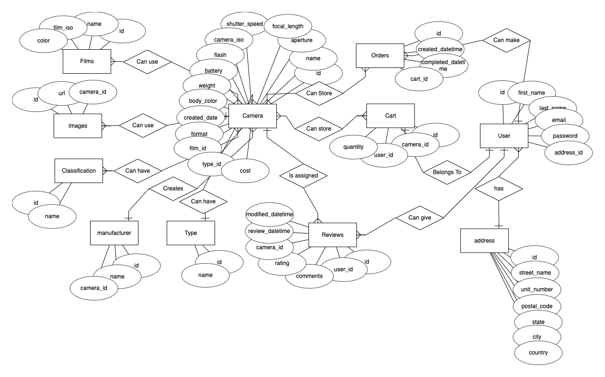

#  The Analog Space Admin and RESTful API

The Analog Space's admin site is utilised for product and order management. Link to the management site hosted on heroku can be found [here](https://the-analog-space.herokuapp.com/)

## Context

- This project's site management was built using [Express.js](https://expressjs.com/). And displayed using the [HBS](https://www.npmjs.com/package/hbs) view engine 
- The repository that builds the consumer site using react can be found [here](https://github.com/happygoalvin/The-Analog-Space-React)

## Database Creation Documentation

### Logical Schema

 

### ER Diagram

 

# Endpoints

End Point Type | End Point Name | Purpose
------------ | ------------- | -------------
GET | /api/cart/ | Obtain all data in user's cart
POST | /api/cart/add | Creates data on user's cart with a specific product ID
DELETE | /api/cart/remove | Removes a specific product data in the cart
PUT | /api/cart/quantity/update | Adds 1 to the quantity on a specific product in the cart
PUT | /api/cart/quantity/remove | Minus 1 to the quantity on a specific product in the cart
POST | /api/checkout/process_payment | Designed for webhooks to return data for further processing into respective tables
GET | /api/checkout/ | Obtains all information needed to send to stripe for payment processing. Redirects user to stripe checkout.
POST | /api/users/login | Allows user to login and generates access token and refresh token assigned to the user
GET | /api/users/profile | Fetches all data on specific user
POST | /api/users/refresh | refreshes the accesss token and verify if refresh token has expired to be stored in the blacklisted tokens.
POST | /api/users/logout | Logs user out and send refresh token to be blacklisted
POST | /api/users/register | Creates a new user in the database
GET | /api/users/update | Retrieve user info for updating personal information
PUT | /api/users/update | Allows user to update password
GET | /api/cameras/ | Retrieves all products sorted by their date of creation to populate the new arrivals
GET | /api/cameras/products | Retrieves all products in no order
GET | /api/cameras/products/:camera_id | Retrieves specific camera data
POST | /api/cameras/products | Allows user to filter products
GET | /api/cameras/classifications | Retrieves all classifications
GET | /api/cameras/manufacturer | Retrieves all manufacturer data
GET | /api/cameras/films | Retrieves all film data
GET | /api/cameras/type | Retrieves all type data
GET | /api/orders/ | Retrieve all orders from a specific user
GET | /api/orders/:order_id | Retrieves all purchase data from a specific order ID

# Technologies Used

- [Express.js](https://expressjs.com/)

  This project utilises Express.js. A fast, unopinionated, minimalist web framework for Node.js

- [Postgres](https://www.postgresql.org/)

  Heroku deploys postgres SQL

- [MySql](https://www.mysql.com/)

  Used for testing in local environment and building migration files

- [BookShelf ORM](https://bookshelfjs.org/)

  Used for Object-Relational Mapping

- [db migrate](https://www.npmjs.com/package/db-migrate)

  To allow for migration of data from MySQL to postgres 

# Deployment

- [Heroku](https://dashboard.heroku.com/)

  This API is deployed using Heroku.

# Acknowledgements

Paul Chor for his teachings and contributions, which helped me to build a backend development framework.